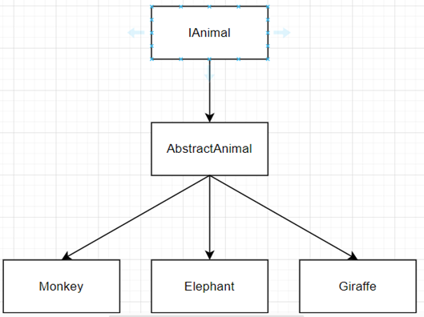

# ZooSimulatorLibrary:
The Zoo Simulator is a meticulously architected application designed to model a dynamic zoo 
environment where diverse animals interact, exhibit behaviours, and maintain health statuses. 
Central to its robustness and maintainability, the simulator rigorously adheres to the SOLID
principles, ensuring each class has a single responsibility, remains open for extension but 
closed for modification, and upholds reliable inheritance and interface segregation. This 
adherence facilitates seamless scalability and ease of maintenance. 

Complementing these principles, the Zoo Simulator employs a variety of design patterns such 
as the Strategy Pattern for flexible health management, the Observer Pattern to handle 
dynamic event notifications, the State Pattern for managing animal life states, and the Factory 
Method Pattern to streamline the creation of diverse animal types. The Singleton Pattern and
the Template Pattern are also used.

Additionally, the Disposable Pattern ensures efficient resource management, preventing 
memory leaks and promoting optimal performance. Together, these SOLID principles and 
design patterns create a highly organized, extensible, and resilient architecture, enabling the 
Zoo Simulator to efficiently manage complex interactions and evolve with future 
enhancements.

Furthermore, asynchronous programming is widely used to run background processes that 
monitors and handles animal’s life over a given time period.
This backend logic has been written in a .NET Core library named ZooSimulator Library. It is 
available through NuGet Package downloadable by writing ZooSimulatorLibrary or by searching 
the developer’s name: Salvatore Amaddio.

# SOLID:
The Zoo Simulator meticulously adheres to the SOLID principles, ensuring a well-structured, 
maintainable, and scalable architecture. Single Responsibility is exemplified through distinct 
classes such as HealthService, FeedingService, and MortuaryService, each dedicated to 
managing specific aspects of animal care and zoo operations. 

The Open/Closed Principle is upheld by designing classes that are open for extension but 
closed for modification; for example, new animal types like Lion or Tiger can be integrated by 
extending the AbstractAnimal class without altering existing service implementations. 

Liskov Substitution is maintained by ensuring that subclasses of AbstractAnimal, such as 
Monkey, Giraffe, and Elephant, can seamlessly replace their superclass without affecting the 
correctness of the program. 

The Interface Segregation Principle is achieved by utilizing focused interfaces like 
IHealthService and IFeedingService, which prevent classes from being burdened with 
unnecessary methods and promote cleaner, more modular code. 

Lastly, the Dependency Inversion Principle is implemented by depending on abstractions 
rather than concrete classes; services are injected into classes like AbstractZoo through 
interfaces, enhancing flexibility and facilitating easier testing and maintenance. Collectively, 
these SOLID principles fortify the Zoo Simulator's architecture, making it robust against 
changes and scalable for future enhancements

# Design Patterns:

## Animal Template Pattern

## Animal Strategy Pattern

Interfaces like **IHealthService** and **IHealthMonitorService** represent different strategies for managing and monitoring
animal health. Concrete implementations such as **GeneralHealthService**, **GeneralHealthMonitorService**, 
and **ElephantHealthMonitorService** encapsulate specific behaviors, 
allowing for dynamic selection and modification of health-related algorithms without altering the animal classes.

## State Change Pattern

## Zoo Template Pattern

## Zoo Strategy Pattern

